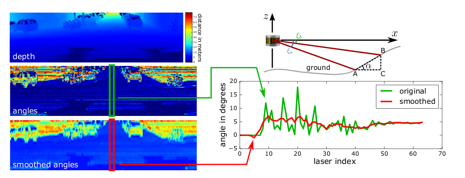
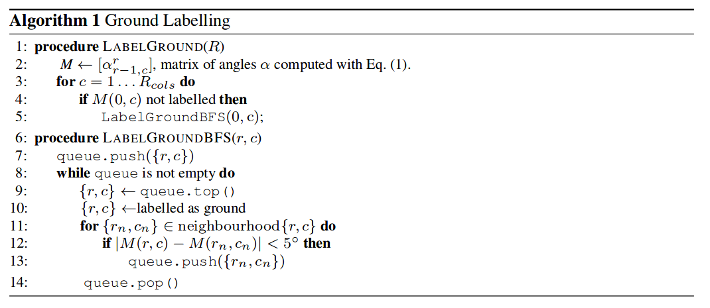
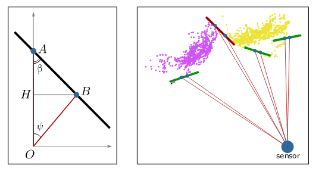
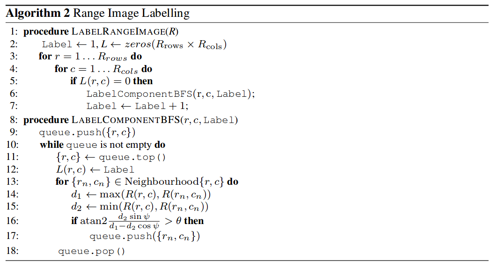
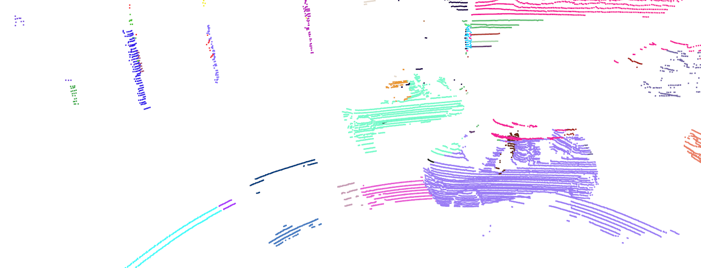

整个任务是基于\<Fast Range Image-Based Segmentation of Sparse 3D Laser Scans for Online Operation\>,  用激光雷达线束角度阈值来进行物体分割, 论文原代码地址: [Github](https://github.com/PRBonn/depth_clustering)

- task1 : 对论文解析与原代码解析
- task2 : 每帧聚类结果全部分别保存到文件夹下
- task3 : 读取task2保存下的所有聚类结果, 使用pcl用不同的颜色对整帧进行可视化. 

# task1-论文解析与原代码解析

## 论文原理解析

- 将3D点云先投影成前视图,

- 计算延col角度差值,并平滑.然后根据角度阈值去除地面
	
	

- 计算延row角度差值,并平滑.然后根据角度阈值对点云进行聚类
	
	
## 可调参数
1. 地面去除角度阈值 2. 点云聚类角度阈值 3. 最大聚类点数 4. 最小聚类点数    
可在qt界面下调试后,使用pcl可视化效果.感觉聚类效果有限.
## 原代码解析
以下详细说明各代码作用:
- depth_clustering
	- examples
		- ros_nodes: 两个ros节点
			- save_cluster_node.cpp: 订阅点云,保存聚类结果
			- show_objects_node.cpp: 订阅点云,显示聚类结果bbox
		- simple_nodes
			- show_objects_kitti.cpp: 输入bin点云路径,显示bbox结果.参数:--path, --angle \<int\>(Below this value, the objects are separated)
			- show_objects_moosmann.cpp: 输入图片点云路径, 显示bbox结果.参数同上.
	- src: 所有原理实现
		- clusters: 聚类(其中包括角度聚类和欧式距离聚类)
		- communication: 定义抽象父类(无功能性)
		- ground_removal: 地面移除
		- image_labelers
		- projections: 3D点云投影
		- qt: qt界面,编译后运行可执行文件  qt_gui_app
		- ros_bridge: 实现话题订阅
		- utils: 文件读取,bbox等工具
		- visualization: 可视化与点云保存

# task2-每帧聚类结果全部保存到文件夹下
## Solution1-基于ROS
- 代码说明 
	基于源码\$ws\$/src/depth_clustering/examples/ros_nodes/save_clusters_node.cpp,只需修改第75行订阅topic.  
	建立点云发布节点,以sense_msg::PointCloud格式发布来即可
- 运行步骤
	rosrun depth_clustering save_clusters_node --num_beams 64

## Solution2-qt界面打开bin文件夹
- 代码说明
	基于源代码qt_gui_app修改,在中间过程添加保存代码.   
	以下对image_based_cluster.cpp的修改做以说明(修改处皆以//=====开头注明,不需要保存时需要手动注释):   
	
	```C++
	//39行,添加
	#include <pcl/io/pcd_io.h>
	```
	
	```C++
  //154行
    std::string _prefix = "clusters";
  auto folder_name = _prefix + "_" + WithLeadingZerosStr(folder_counter++);
  
    boost::filesystem::path dir(folder_name);
    size_t cloud_counter = 0;
    if (boost::filesystem::create_directory(dir)) {
      for (const auto &kv : clusters) {
        const auto &cloud = kv.second;
        auto cloud_name = dir.string() + "/cloud_" +
                          WithLeadingZerosStr(cloud_counter++) + ".pcd";
        pcl::io::savePCDFileBinary(cloud_name, *(cloud.ToPcl()));
      }
	  }
	```

- 运行步骤
	* 直接替换路径\$ws\$/src/depth_clustering/src/clusterers下的image_based_cluster.cpp文件
	* \$ws\$/devel/lib/depth_clustering下运行./qt_gui_app
	* qt界面选择bin文件类型,open folder到bin文件夹
	* 先不play,用第一帧设置聚类参数
	* 点击player开始(也可只生成单独一帧,不play直接输入帧数)
	* 点云聚类结果pcd将保存到ws/devel/lib/depth_clustering下

# task3-点云聚类可视化结果图
- C++PCL可视化
	读取问文件夹下的所有聚类结果,使用pcl用不同的颜色展示.      
	代码在./code/task3/multi_visualize.cpp,有详细的注释.直接运行即可     
- 可视化效果
	调了下参数,感觉影响不大.近处的地面去除和车顶棚分离的效果比较明晰.
